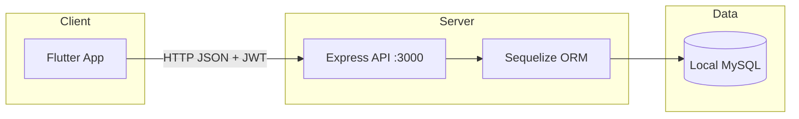

# NeuroFlux

[](https://nodejs.org/)
[](https://expressjs.com/)
[](https://sequelize.org/)
[](https://www.mysql.com/)
[](https://flutter.dev/)
[](https://dart.dev/)
[](#license)

[Português](README.md) · **English**

**Small steps, big achievements.**

A productivity app for neurodivergent people — with a focus on **ADHD** — for task organization and reducing **executive overload**. The project breaks goals into smaller steps (tasks and subtasks), shows daily visual progress, and offers an interface designed to lower cognitive friction.

> Academic project built as a full-stack solution: **Flutter** client (cross-platform) and **REST** API on **Node.js**, with a local **MySQL** database.

---

## Table of contents

- [About the project](#about-the-project)
- [Features](#features)
- [Technologies](#technologies)
- [Architecture](#architecture)
- [Repository structure](#repository-structure)
- [Prerequisites](#prerequisites)
- [Environment setup](#environment-setup)
- [Local database (MySQL)](#local-database-mysql)
- [Running the API](#running-the-api)
- [Running the Flutter app](#running-the-flutter-app)
- [API endpoints](#api-endpoints)
- [App usage flow](#app-usage-flow)
- [Troubleshooting](#troubleshooting)
- [License](#license)

---

## About the project

**NeuroFlux** was created to meet the need for organization tools that respect the cognitive patterns of people with ADHD and other neurodivergences. Instead of generic lists, the app focuses on:

- **Task breakdown** into optional subtasks, making it easier to start activities (“chunking”).
- **Visual progress feedback** (completed vs. pending tasks).
- **A simple flow** for sign-up, login, and daily management.

Communication between the app and the server uses **HTTP/JSON**, with **JWT** authentication (Bearer token) on protected routes.

---

## Features

| Area | Description |
|------|-------------|
| **Authentication** | User registration, login, and JWT session |
| **Tasks** | Create, list, edit, and mark tasks as completed |
| **Subtasks** | Split a task into smaller steps |
| **Progress** | Dedicated screen for completed and pending tasks |
| **Daily progress** | Indicator on the main tab (e.g. “X of Y tasks completed”) |

---

## Technologies

### Frontend — `flutter_application_1/`

| Technology | Usage |
|------------|-------|
| [Flutter](https://flutter.dev/) (Dart 3+) | Cross-platform UI |
| [Material Design](https://m3.material.io/) | Components and visual theme |
| [http](https://pub.dev/packages/http) | HTTP client for the REST API |

**Code organization (layers):**

- `lib/core/` — theme, constants, exceptions
- `lib/data/services/` — `ApiClient`, `AuthService`, `TarefaService`, `SubtarefaService`
- `lib/domain/models/` — domain models
- `lib/presentation/` — screens and widgets

### Backend — `backend/`

| Technology | Usage |
|------------|-------|
| [Node.js](https://nodejs.org/) | Server runtime |
| [Express](https://expressjs.com/) 5.x | REST API |
| [Sequelize](https://sequelize.org/) | ORM and migrations |
| [MySQL](https://www.mysql.com/) | Local relational database |
| [bcryptjs](https://www.npmjs.com/package/bcryptjs) | Password hashing |
| [jsonwebtoken](https://www.npmjs.com/package/jsonwebtoken) | JWT authentication |
| [dotenv](https://www.npmjs.com/package/dotenv) | Environment variables |
| [cors](https://www.npmjs.com/package/cors) | CORS for the Flutter client |

### Development tools

This project **does not use Android Studio**. Development was done with **Visual Studio Code** (or Visual Studio) and the **Flutter/Dart extension**, running the app mainly on **Windows desktop** (`flutter run -d windows`). **Visual Studio 2022** (*Desktop development with C++* workload) is required to build the Flutter Windows target.

---

## Architecture



**Data model (summary):**

- **Usuarios** — `nome`, `email`, `senha` (hash), `role` (`admin` \| `user`)
- **Tarefas** — linked to user (`usuarioId`)
- **Subtarefas** — linked to task (`tarefaId`)

---

## Repository structure

```
neuroflux/
├── README.md
├── README.en.md
├── backend/                    # REST API
│   ├── server.js               # Server entry point
│   ├── config/                 # Sequelize configuration
│   ├── controllers/
│   ├── middlewares/            # JWT and authorization
│   ├── migrations/
│   ├── models/
│   └── routes/
└── flutter_application_1/      # Flutter app
    └── lib/
        ├── main.dart
        ├── core/
        ├── data/services/
        ├── domain/models/
        └── presentation/
```

---

## Prerequisites

Install and configure the following before running the project:

| Tool | Suggested version | Notes |
|------|-------------------|-------|
| **Node.js** | 18 LTS or higher | `node -v` |
| **npm** | Bundled with Node | `npm -v` |
| **MySQL Server** | 8.x | Local service (e.g. MySQL Workbench) |
| **Flutter SDK** | 3.x (Dart ≥ 3.0) | [Official install guide](https://docs.flutter.dev/get-started/install) |
| **Git** | Any recent version | Repository clone |
| **Visual Studio 2022** | Community or higher | *Desktop development with C++* workload (Windows build) |
| **Editor** | VS Code recommended | **Flutter** and **Dart** extensions |

Verify your Flutter environment:

```bash
flutter doctor
```

Fix any issues reported (SDK, optional Android licenses, Windows toolchain).

---

## Environment setup

### 1. Clone the repository

```bash
git clone https://github.com/vasconcelosfelipe642-lang/neuroflux.git
cd neuroflux
```

### 2. API environment variables

In the `backend/` folder, create a `.env` file (not versioned — see `.gitignore`):

```env
PORT=3000

DB_HOST=localhost
DB_PORT=3306
DB_USER=root
DB_PASSWORD=your_mysql_password
DB_NAME=neuroflux

JWT_SECRET=a_long_random_secret_key
```

> **Important:** use your own passwords and secrets. Never commit the `.env` file.

If you run **migrations** with Sequelize CLI, also align `backend/config/config.json` (`development` environment) with the same user, password, and database as `.env`.

### 3. Backend dependencies

```bash
cd backend
npm install
```

### 4. Flutter dependencies

```bash
cd ../flutter_application_1
flutter pub get
```

The API base URL is in `lib/data/services/api_client.dart` (default: `http://localhost:3000`). Change `_baseUrl` in that file for a different host or port.

---

## Local database (MySQL)

### Create the database

Connect to MySQL (CLI, Workbench, or another client) and run:

```sql
CREATE DATABASE neuroflux
  CHARACTER SET utf8mb4
  COLLATE utf8mb4_unicode_ci;
```

Ensure the user defined in `DB_USER` has permission on this database.

### Create tables

Two approaches work with this project:

#### Option A — Automatic on API startup (recommended for development)

`server.js` calls `sequelize.sync()` on startup. When you run `npm start`, tables are created/updated from the models, as long as MySQL is reachable.

#### Option B — Migrations with Sequelize CLI

```bash
cd backend
npx sequelize-cli db:migrate
```

Available migrations:

- `create-usuario`
- `create-tarefa`
- `create-subtarefa`

To revert the last migration:

```bash
npx sequelize-cli db:migrate:undo
```

---

## Running the API

With MySQL running and `.env` configured:

```bash
cd backend
npm start
```

Expected output:

```text
DB sincronizado e MySQL conectado!
Servidor Neuroflux rodando em http://localhost:3000
```

Quick test in the browser or with curl:

```bash
curl http://localhost:3000
```

Response: `API Neuroflux funcionando`

---

## Running the Flutter app

**Recommended order:** 1) MySQL running → 2) API running → 3) Flutter app.

### From the terminal

```bash
cd flutter_application_1
flutter devices
flutter run -d windows
```

Other targets (if configured):

```bash
flutter run -d chrome    # Web
flutter run -d edge      # Web (Edge)
```

### From Visual Studio Code

1. Open the `flutter_application_1` folder (or the monorepo root).
2. Install the **Flutter** and **Dart** extensions.
3. Select the **Windows** device in the status bar.
4. Press **F5** or use *Run > Start Debugging*.

> **Android Studio is not required.** For this academic project, the main documented flow is **Windows desktop** via Visual Studio 2022 toolchain + Flutter extension in the editor.

---

## API endpoints

Base URL: `http://localhost:3000`

### Public (no token)

| Method | Route | Description |
|--------|-------|-------------|
| `GET` | `/` | API health check |
| `GET` | `/teste-user` | Test route |
| `POST` | `/register` | User registration |
| `POST` | `/login` | Login (returns JWT) |

### Protected (header `Authorization: Bearer <token>`)

| Method | Route | Description |
|--------|-------|-------------|
| `GET` | `/usuarios` | List users |
| `GET` | `/usuarios/:id` | Get user |
| `PUT` | `/usuarios/:id` | Update user |
| `DELETE` | `/usuarios/:id` | Delete user (admin) |
| `POST` | `/tarefas` | Create task |
| `GET` | `/tarefas` | List user tasks |
| `GET` | `/tarefas/:id` | Get task |
| `PUT` | `/tarefas/:id` | Update task |
| `DELETE` | `/tarefas/:id` | Delete task |
| `POST` | `/subtarefas` | Create subtask |
| `GET` | `/subtarefas` | List subtasks |
| `GET` | `/subtarefas/:id` | Get subtask |
| `PUT` | `/subtarefas/:id` | Update subtask |
| `DELETE` | `/subtarefas/:id` | Delete subtask |

**Login example:**

```bash
curl -X POST http://localhost:3000/login \
  -H "Content-Type: application/json" \
  -d "{\"email\":\"you@email.com\",\"senha\":\"your_password\"}"
```

---

## App usage flow

1. **Sign up** or **log in** with email and password.
2. On the **Tasks** tab, create a new task (with optional subtasks).
3. Mark tasks and subtasks as completed as you progress.
4. Track **daily progress** on the top card and on the **Progress** tab.

---

## Troubleshooting

| Issue | Possible cause | What to do |
|-------|----------------|------------|
| `Erro ao iniciar o servidor` / connection failure | MySQL stopped or wrong credentials | Start MySQL; check `.env` |
| `Access denied for user` | MySQL user/password | Update `DB_USER` and `DB_PASSWORD` |
| App does not load tasks | API offline or wrong URL | Confirm `npm start` and `_baseUrl` in `api_client.dart` |
| `flutter run -d windows` fails | Missing C++ toolchain | Install VS 2022 with *Desktop development with C++*; run `flutter doctor` |
| Network error on Android emulator | `localhost` on emulator | Use `10.0.2.2:3000` instead of `localhost` (if testing on Android) |
| Invalid token after 1 h | JWT expiration | Log in again (`expiresIn: '1h'`) |

---

## Academic context

This repository documents an **academic software development project**. The goal is to demonstrate integration between mobile/desktop (Flutter), REST API (Node.js/Express), and a relational database (MySQL), applied to real cognitive accessibility needs for people with ADHD.

---

## License

Academic project — contact the course authors or institution for terms of use and distribution.

---

## Quick reference

| Command | Location |
|---------|----------|
| `npm install` | `backend/` |
| `npm start` | `backend/` — starts API on port 3000 |
| `npx sequelize-cli db:migrate` | `backend/` — manual migrations |
| `flutter pub get` | `flutter_application_1/` |
| `flutter run -d windows` | `flutter_application_1/` — desktop app |
