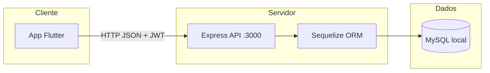

# NeuroFlux

[](https://nodejs.org/)
[](https://expressjs.com/)
[](https://sequelize.org/)
[](https://www.mysql.com/)
[](https://flutter.dev/)
[](https://dart.dev/)
[](#licença)

**Português** · [English](README.en.md)

**Pequenas etapas, grandes conquistas.**

Aplicativo de produtividade voltado a pessoas neurodivergentes — com foco em **TDAH** — para organização de tarefas e redução da **sobrecarga executiva**. O projeto divide objetivos em etapas menores (tarefas e subtarefas), exibe progresso visual do dia e oferece uma interface pensada para diminuir fricção cognitiva.

> Projeto acadêmico desenvolvido como solução full stack: cliente **Flutter** (multiplataforma) e API **REST** em **Node.js**, com persistência em **MySQL** local.

---

## Sumário

- [Sobre o projeto](#sobre-o-projeto)
- [Funcionalidades](#funcionalidades)
- [Tecnologias](#tecnologias)
- [Arquitetura](#arquitetura)
- [Estrutura do repositório](#estrutura-do-repositório)
- [Pré-requisitos](#pré-requisitos)
- [Configuração do ambiente](#configuração-do-ambiente)
- [Banco de dados local (MySQL)](#banco-de-dados-local-mysql)
- [Executando a API](#executando-a-api)
- [Executando o app Flutter](#executando-o-app-flutter)
- [Endpoints da API](#endpoints-da-api)
- [Fluxo de uso do aplicativo](#fluxo-de-uso-do-aplicativo)
- [Solução de problemas](#solução-de-problemas)
- [Licença](#licença)

---

## Sobre o projeto

O **NeuroFlux** nasce da necessidade de ferramentas de organização que respeitem o funcionamento cognitivo de pessoas com TDAH e outras neurodivergências. Em vez de listas genéricas, o app prioriza:

- **Quebra de tarefas** em subtarefas opcionais, facilitando o início de atividades (“chunking”).
- **Feedback visual de progresso** (tarefas concluídas vs. pendentes).
- **Fluxo simples** de cadastro, login e gestão do dia.

A comunicação entre o app e o servidor ocorre via **HTTP/JSON**, com autenticação **JWT** (Bearer token) nas rotas protegidas.

---

## Funcionalidades

| Área | Descrição |
|------|-----------|
| **Autenticação** | Cadastro de usuário, login e sessão via token JWT |
| **Tarefas** | Criar, listar, editar e marcar tarefas como concluídas |
| **Subtarefas** | Dividir uma tarefa em passos menores |
| **Progresso** | Tela dedicada com visão de tarefas completas e pendentes |
| **Progresso do dia** | Indicador na aba principal (ex.: “X de Y tarefas concluídas”) |

---

## Tecnologias

### Frontend — `flutter_application_1/`

| Tecnologia | Uso |
|------------|-----|
| [Flutter](https://flutter.dev/) (Dart 3+) | Interface multiplataforma |
| [Material Design](https://m3.material.io/) | Componentes e tema visual |
| [http](https://pub.dev/packages/http) | Cliente HTTP para a API REST |

**Organização do código (camadas):**

- `lib/core/` — tema, constantes, exceções
- `lib/data/services/` — `ApiClient`, `AuthService`, `TarefaService`, `SubtarefaService`
- `lib/domain/models/` — modelos de domínio
- `lib/presentation/` — telas e widgets

### Backend — `backend/`

| Tecnologia | Uso |
|------------|-----|
| [Node.js](https://nodejs.org/) | Runtime do servidor |
| [Express](https://expressjs.com/) 5.x | API REST |
| [Sequelize](https://sequelize.org/) | ORM e migrations |
| [MySQL](https://www.mysql.com/) | Banco de dados relacional local |
| [bcryptjs](https://www.npmjs.com/package/bcryptjs) | Hash de senhas |
| [jsonwebtoken](https://www.npmjs.com/package/jsonwebtoken) | Autenticação JWT |
| [dotenv](https://www.npmjs.com/package/dotenv) | Variáveis de ambiente |
| [cors](https://www.npmjs.com/package/cors) | CORS para o cliente Flutter |

### Ferramentas de desenvolvimento

Este projeto **não utiliza Android Studio**. O desenvolvimento foi feito com **Visual Studio Code** (ou Visual Studio) e a **extensão Flutter/Dart**, executando o app principalmente em **Windows desktop** (`flutter run -d windows`). O **Visual Studio 2022** (carga de trabalho *Desenvolvimento para desktop com C++*) é necessário para compilar o target Windows do Flutter.

---

## Arquitetura



**Modelo de dados (resumo):**

- **Usuarios** — `nome`, `email`, `senha` (hash), `role` (`admin` \| `user`)
- **Tarefas** — vinculadas ao usuário (`usuarioId`)
- **Subtarefas** — vinculadas à tarefa (`tarefaId`)

---

## Estrutura do repositório

```
neuroflux/
├── README.md
├── README.en.md
├── backend/                    # API REST
│   ├── server.js               # Entrada do servidor
│   ├── config/                 # Configuração Sequelize
│   ├── controllers/
│   ├── middlewares/            # JWT e autorização
│   ├── migrations/
│   ├── models/
│   └── routes/
└── flutter_application_1/      # App Flutter
    └── lib/
        ├── main.dart
        ├── core/
        ├── data/services/
        ├── domain/models/
        └── presentation/
```

---

## Pré-requisitos

Instale e configure os itens abaixo antes de rodar o projeto:

| Ferramenta | Versão sugerida | Observação |
|------------|-----------------|------------|
| **Node.js** | 18 LTS ou superior | `node -v` |
| **npm** | Incluso no Node | `npm -v` |
| **MySQL Server** | 8.x | Serviço local (ex.: MySQL Workbench) |
| **Flutter SDK** | 3.x (Dart ≥ 3.0) | [Instalação oficial](https://docs.flutter.dev/get-started/install) |
| **Git** | Qualquer recente | Clone do repositório |
| **Visual Studio 2022** | Community ou superior | Carga *Desktop development with C++* (build Windows) |
| **Editor** | VS Code recomendado | Extensões **Flutter** e **Dart** |

Verifique o ambiente Flutter:

```bash
flutter doctor
```

Corrija pendências indicadas (SDK, licenças Android opcionais, toolchain Windows).

---

## Configuração do ambiente

### 1. Clonar o repositório

```bash
git clone https://github.com/vasconcelosfelipe642-lang/neuroflux.git
cd neuroflux
```

### 2. Variáveis de ambiente da API

Na pasta `backend/`, crie o arquivo `.env` (não versionado — veja `.gitignore`):

```env
PORT=3000

DB_HOST=localhost
DB_PORT=3306
DB_USER=root
DB_PASSWORD=sua_senha_mysql
DB_NAME=neuroflux

JWT_SECRET=uma_chave_secreta_longa_e_aleatoria
```

> **Importante:** use senhas e segredos próprios no seu ambiente. Nunca commite o arquivo `.env`.

Se for executar **migrations** com Sequelize CLI, alinhe também `backend/config/config.json` (ambiente `development`) com o mesmo usuário, senha e banco do `.env`.

### 3. Dependências do backend

```bash
cd backend
npm install
```

### 4. Dependências do Flutter

```bash
cd ../flutter_application_1
flutter pub get
```

A URL base da API está em `lib/data/services/api_client.dart` (padrão: `http://localhost:3000`). Para outro host ou porta, altere `_baseUrl` nesse arquivo.

---

## Banco de dados local (MySQL)

### Criar o banco

Conecte-se ao MySQL (CLI, Workbench ou outro cliente) e execute:

```sql
CREATE DATABASE neuroflux
  CHARACTER SET utf8mb4
  COLLATE utf8mb4_unicode_ci;
```

Confirme que o usuário definido em `DB_USER` possui permissão sobre esse banco.

### Criar tabelas

Há duas formas compatíveis com este projeto:

#### Opção A — Automática ao iniciar a API (recomendada para desenvolvimento)

O `server.js` chama `sequelize.sync()` na subida. Ao rodar `npm start`, as tabelas são criadas/atualizadas conforme os models, desde que o MySQL esteja acessível.

#### Opção B — Migrations com Sequelize CLI

```bash
cd backend
npx sequelize-cli db:migrate
```

Migrations disponíveis:

- `create-usuario`
- `create-tarefa`
- `create-subtarefa`

Para reverter a última migration:

```bash
npx sequelize-cli db:migrate:undo
```

---

## Executando a API

Com o MySQL em execução e o `.env` configurado:

```bash
cd backend
npm start
```

Saída esperada:

```text
DB sincronizado e MySQL conectado!
Servidor Neuroflux rodando em http://localhost:3000
```

Teste rápido no navegador ou com curl:

```bash
curl http://localhost:3000
```

Resposta: `API Neuroflux funcionando`

---

## Executando o app Flutter

**Ordem recomendada:** 1) MySQL ativo → 2) API rodando → 3) App Flutter.

### Pelo terminal

```bash
cd flutter_application_1
flutter devices
flutter run -d windows
```

Outros alvos (se configurados):

```bash
flutter run -d chrome    # Web
flutter run -d edge      # Web (Edge)
```

### Pelo Visual Studio Code

1. Abra a pasta `flutter_application_1` (ou a raiz do monorepo).
2. Instale as extensões **Flutter** e **Dart**.
3. Selecione o dispositivo **Windows** na barra inferior.
4. Pressione **F5** ou use *Run > Start Debugging*.

> **Android Studio não é obrigatório.** Para este projeto acadêmico, o fluxo principal documentado é **Windows desktop** via toolchain do Visual Studio 2022 + extensão Flutter no editor.

---

## Endpoints da API

Base URL: `http://localhost:3000`

### Públicos (sem token)

| Método | Rota | Descrição |
|--------|------|-----------|
| `GET` | `/` | Health check da API |
| `GET` | `/teste-user` | Rota de teste |
| `POST` | `/register` | Cadastro de usuário |
| `POST` | `/login` | Login (retorna JWT) |

### Protegidos (header `Authorization: Bearer <token>`)

| Método | Rota | Descrição |
|--------|------|-----------|
| `GET` | `/usuarios` | Listar usuários |
| `GET` | `/usuarios/:id` | Buscar usuário |
| `PUT` | `/usuarios/:id` | Atualizar usuário |
| `DELETE` | `/usuarios/:id` | Excluir usuário (admin) |
| `POST` | `/tarefas` | Criar tarefa |
| `GET` | `/tarefas` | Listar tarefas do usuário |
| `GET` | `/tarefas/:id` | Detalhar tarefa |
| `PUT` | `/tarefas/:id` | Atualizar tarefa |
| `DELETE` | `/tarefas/:id` | Excluir tarefa |
| `POST` | `/subtarefas` | Criar subtarefa |
| `GET` | `/subtarefas` | Listar subtarefas |
| `GET` | `/subtarefas/:id` | Detalhar subtarefa |
| `PUT` | `/subtarefas/:id` | Atualizar subtarefa |
| `DELETE` | `/subtarefas/:id` | Excluir subtarefa |

**Exemplo de login:**

```bash
curl -X POST http://localhost:3000/login \
  -H "Content-Type: application/json" \
  -d "{\"email\":\"seu@email.com\",\"senha\":\"sua_senha\"}"
```

---

## Fluxo de uso do aplicativo

1. **Cadastre-se** ou **entre** com e-mail e senha.
2. Na aba **Tarefas**, crie uma nova tarefa (com subtarefas opcionais).
3. Marque tarefas e subtarefas como concluídas conforme avançar.
4. Acompanhe o **progresso do dia** no card superior e na aba **Progresso**.

---

## Solução de problemas

| Problema | Possível causa | O que fazer |
|----------|----------------|-------------|
| `Erro ao iniciar o servidor` / falha de conexão | MySQL parado ou credenciais incorretas | Inicie o serviço MySQL; revise `.env` |
| `Access denied for user` | Usuário/senha do MySQL | Ajuste `DB_USER` e `DB_PASSWORD` |
| App não carrega tarefas | API offline ou URL errada | Confirme `npm start` e `_baseUrl` em `api_client.dart` |
| `flutter run -d windows` falha | Falta toolchain C++ | Instale VS 2022 com *Desktop development with C++*; rode `flutter doctor` |
| Erro de rede no emulador Android | `localhost` no emulador | Use `10.0.2.2:3000` no lugar de `localhost` (se testar em Android) |
| Token inválido após 1 h | Expiração JWT | Faça login novamente (`expiresIn: '1h'`) |

---

## Contexto acadêmico

Este repositório documenta um **trabalho acadêmico** de desenvolvimento de software. O objetivo é demonstrar integração entre mobile/desktop (Flutter), API REST (Node.js/Express) e banco relacional (MySQL), aplicados a um problema real de acessibilidade cognitiva para pessoas com TDAH.

---

## Licença

Projeto acadêmico — consulte os autores da disciplina/instituição para termos de uso e distribuição.

---

## Referências rápidas

| Comando | Onde |
|---------|------|
| `npm install` | `backend/` |
| `npm start` | `backend/` — sobe API na porta 3000 |
| `npx sequelize-cli db:migrate` | `backend/` — migrations manuais |
| `flutter pub get` | `flutter_application_1/` |
| `flutter run -d windows` | `flutter_application_1/` — app desktop |
