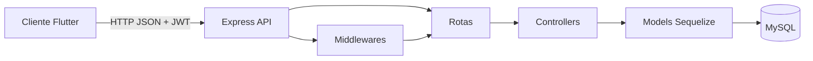

# NeuroFlux Backend

[](https://nodejs.org/)
[](https://expressjs.com/)
[](https://sequelize.org/)
[](https://www.mysql.com/)
[](https://jwt.io/)
[](#licença)

API REST do **NeuroFlux**, responsável pela autenticação, gerenciamento de usuários, tarefas e subtarefas do aplicativo.

**Pequenas etapas, grandes conquistas.**

> Backend acadêmico desenvolvido em **Node.js + Express**, com persistência em **MySQL**, ORM **Sequelize** e autenticação via **JWT**.

---

## Sumário

- [Sobre o backend](#sobre-o-backend)
- [Funcionalidades](#funcionalidades)
- [Tecnologias](#tecnologias)
- [Arquitetura da API](#arquitetura-da-api)
- [Estrutura de pastas](#estrutura-de-pastas)
- [Modelo de dados](#modelo-de-dados)
- [Pré-requisitos](#pré-requisitos)
- [Configuração do ambiente](#configuração-do-ambiente)
- [Arquivos de exemplo](#arquivos-de-exemplo)
- [Banco de dados](#banco-de-dados)
- [Executando o servidor](#executando-o-servidor)
- [Endpoints da API](#endpoints-da-api)
- [Autenticação e permissões](#autenticação-e-permissões)
- [Exemplos de requisições](#exemplos-de-requisições)
- [Scripts disponíveis](#scripts-disponíveis)
- [Solução de problemas](#solução-de-problemas)
- [Contexto acadêmico](#contexto-acadêmico)
- [Licença](#licença)

---

## Sobre o backend

O backend do **NeuroFlux** é a camada responsável por processar as regras principais da aplicação e fornecer dados ao cliente Flutter por meio de uma API REST.

Ele centraliza:

- Cadastro e login de usuários.
- Geração e validação de tokens JWT.
- Controle de permissões por perfil.
- Gerenciamento de usuários.
- CRUD de tarefas.
- CRUD de subtarefas.
- Associação entre usuários, tarefas e subtarefas.
- Persistência dos dados em banco MySQL.

A comunicação com o frontend acontece via **HTTP/JSON**. Rotas protegidas exigem o envio do token no header:

```http
Authorization: Bearer <token>
```

---

## Funcionalidades

| Área | Descrição |
|------|-----------|
| **Autenticação** | Cadastro, login e geração de token JWT |
| **Usuários** | Listagem, consulta, atualização e exclusão de usuários |
| **Perfis** | Controle de acesso por `role`: usuário comum e administrador |
| **Tarefas** | Criação, listagem, consulta, edição e exclusão de tarefas |
| **Subtarefas** | Criação, listagem, consulta, edição e exclusão de subtarefas |
| **Permissões** | Usuário comum acessa seus próprios dados; admin possui acesso ampliado |
| **Banco de dados** | Persistência com MySQL utilizando Sequelize |
| **Soft delete** | Tarefas e subtarefas utilizam exclusão lógica via Sequelize paranoid |

---

## Tecnologias

| Tecnologia | Uso |
|------------|-----|
| [Node.js](https://nodejs.org/) | Runtime JavaScript do servidor |
| [Express](https://expressjs.com/) | Framework para criação da API REST |
| [Sequelize](https://sequelize.org/) | ORM para comunicação com o banco |
| [MySQL](https://www.mysql.com/) | Banco de dados relacional |
| [mysql2](https://www.npmjs.com/package/mysql2) | Driver MySQL para Node.js |
| [bcrypt](https://www.npmjs.com/package/bcrypt) | Comparação de senha no login |
| [bcryptjs](https://www.npmjs.com/package/bcryptjs) | Hash de senhas nos models |
| [jsonwebtoken](https://www.npmjs.com/package/jsonwebtoken) | Geração e validação de JWT |
| [dotenv](https://www.npmjs.com/package/dotenv) | Variáveis de ambiente |
| [cors](https://www.npmjs.com/package/cors) | Liberação de acesso para o frontend |
| [sequelize-cli](https://www.npmjs.com/package/sequelize-cli) | Execução de migrations |

---

## Arquitetura da API



A API segue uma separação simples por camadas:

- **Routes:** definem os caminhos da API.
- **Controllers:** concentram a lógica das requisições.
- **Models:** representam as tabelas do banco.
- **Middlewares:** validam autenticação e autorização.
- **Config:** concentra dados de conexão com o banco.

---

## Estrutura de pastas

```text
backend/
├── config/
│   ├── database.js              # Configuração do banco via variáveis de ambiente
│   └── config.json.example      # Exemplo de configuração para Sequelize CLI
│
├── controllers/
│   ├── UsuarioController.js     # Cadastro, login e gestão de usuários
│   ├── TarefaController.js      # CRUD de tarefas
│   └── SubtarefaController.js   # CRUD de subtarefas
│
├── middlewares/
│   ├── auth.js                  # Validação JWT e verificação de admin
│   └── authorize.js             # Middleware genérico por roles
│
├── migrations/                  # Migrations do Sequelize
│
├── models/
│   ├── index.js                 # Inicialização dos models
│   ├── usuario.js               # Model Usuario
│   ├── tarefa.js                # Model Tarefa
│   └── subtarefa.js             # Model Subtarefa
│
├── routes/
│   ├── index.js                 # Agrupamento das rotas públicas e protegidas
│   ├── usuario.routes.js        # Rotas de usuários e autenticação
│   ├── tarefa.routes.js         # Rotas de tarefas
│   └── subtarefas.routes.js     # Rotas de subtarefas
│
├── .env.example                 # Exemplo de variáveis de ambiente
├── .gitignore
├── .sequelizerc
├── package.json
├── package-lock.json
└── server.js                    # Entrada da aplicação
```

---

## Modelo de dados

### Usuario

Representa o usuário cadastrado no sistema.

| Campo | Tipo | Descrição |
|------|------|-----------|
| `id` | INTEGER | Identificador do usuário |
| `nome` | STRING | Nome do usuário |
| `email` | STRING | E-mail único e válido |
| `senha` | STRING | Senha criptografada |
| `role` | ENUM | Perfil do usuário: `user` ou `admin` |
| `createdAt` | DATE | Data de criação |
| `updatedAt` | DATE | Data de atualização |

Relacionamento:

```text
Usuario 1:N Tarefa
```

---

### Tarefa

Representa uma tarefa criada por um usuário.

| Campo | Tipo | Descrição |
|------|------|-----------|
| `id` | INTEGER | Identificador da tarefa |
| `titulo` | STRING | Título da tarefa |
| `descricao` | TEXT | Descrição opcional |
| `concluida` | BOOLEAN | Status de conclusão da tarefa |
| `usuarioId` | INTEGER | Usuário dono da tarefa |
| `createdAt` | DATE | Data de criação |
| `updatedAt` | DATE | Data de atualização |
| `deletedAt` | DATE | Data de exclusão lógica |

Relacionamentos:

```text
Tarefa N:1 Usuario
Tarefa 1:N Subtarefa
```

---

### Subtarefa

Representa uma etapa menor dentro de uma tarefa.

| Campo | Tipo | Descrição |
|------|------|-----------|
| `id` | INTEGER | Identificador da subtarefa |
| `titulo` | STRING | Título da subtarefa |
| `concluida` | BOOLEAN | Status de conclusão da subtarefa |
| `tarefaId` | INTEGER | Tarefa relacionada |
| `createdAt` | DATE | Data de criação |
| `updatedAt` | DATE | Data de atualização |
| `deletedAt` | DATE | Data de exclusão lógica |

Relacionamento:

```text
Subtarefa N:1 Tarefa
```

---

## Pré-requisitos

Antes de executar o backend, instale:

| Ferramenta | Versão sugerida | Verificação |
|------------|-----------------|-------------|
| **Node.js** | 18 LTS ou superior | `node -v` |
| **npm** | Incluso no Node.js | `npm -v` |
| **MySQL Server** | 8.x | MySQL Workbench ou CLI |
| **Git** | Recente | `git --version` |

---

## Configuração do ambiente

### 1. Clonar o repositório

```bash
git clone https://github.com/vasconcelosfelipe642-lang/neuroflux.git
cd neuroflux/backend
```

---

### 2. Instalar dependências

```bash
npm install
```

---

### 3. Criar o arquivo `.env`

Copie o arquivo de exemplo:

```bash
cp .env.example .env
```

Depois, edite o `.env` com as credenciais do seu MySQL local:

```env
PORT=3000

DB_HOST=localhost
DB_PORT=3306
DB_USER=root
DB_PASSWORD=sua_senha_mysql
DB_NAME=neuroflux

JWT_SECRET=uma_chave_secreta_longa_e_aleatoria
```

> Nunca envie o arquivo `.env` para o GitHub. Ele deve ficar apenas no ambiente local.

---

### 4. Criar o arquivo `config/config.json`

Caso utilize migrations com Sequelize CLI, copie o arquivo de exemplo:

```bash
cp config/config.json.example config/config.json
```

Depois, edite `config/config.json` com os dados do seu MySQL local.

> O arquivo `config/config.json` real também não deve ser enviado ao GitHub, pois pode conter usuário e senha do banco.

---

## Arquivos de exemplo

Para facilitar a configuração local do projeto sem expor credenciais reais, o backend utiliza arquivos de exemplo.

A ideia é manter no GitHub apenas os arquivos `.example`, enquanto os arquivos reais ficam apenas no ambiente local de cada desenvolvedor.

Estrutura recomendada:

```text
backend/
├── .env.example
└── config/
    └── config.json.example
```

---

### `.env.example`

Crie o arquivo abaixo na raiz da pasta `backend/`:

```env
PORT=3000

DB_HOST=localhost
DB_PORT=3306
DB_USER=root
DB_PASSWORD=sua_senha_mysql
DB_NAME=neuroflux

JWT_SECRET=sua_chave_secreta
```

Para usar no ambiente local:

```bash
cp .env.example .env
```

Depois, edite o arquivo `.env` com suas credenciais reais.

> O arquivo `.env` não deve ser enviado para o GitHub.

---

### `config/config.json.example`

Crie o arquivo abaixo em `backend/config/config.json.example`:

```json
{
  "development": {
    "username": "root",
    "password": "sua_senha_mysql",
    "database": "neuroflux",
    "host": "localhost",
    "port": 3306,
    "dialect": "mysql"
  },
  "test": {
    "username": "root",
    "password": "sua_senha_mysql",
    "database": "neuroflux_test",
    "host": "localhost",
    "port": 3306,
    "dialect": "mysql"
  },
  "production": {
    "username": "usuario_producao",
    "password": "senha_producao",
    "database": "neuroflux_production",
    "host": "host_producao",
    "port": 3306,
    "dialect": "mysql"
  }
}
```

Para usar localmente:

```bash
cp config/config.json.example config/config.json
```

Depois, edite `config/config.json` com os dados reais do banco MySQL.

> O arquivo `config/config.json` real não deve ser enviado ao GitHub.

---

### Diferença entre `.env` e `config.json`

| Arquivo | Usado por | Finalidade |
|--------|-----------|------------|
| `.env` | Aplicação Node.js | Configurar servidor, banco e JWT em tempo de execução |
| `config/config.json` | Sequelize CLI e `models/index.js` | Configurar conexão do Sequelize por ambiente |

Em resumo:

- O `.env` guarda variáveis usadas pelo servidor.
- O `config/config.json` é usado pelo Sequelize para conectar ao banco.
- Os arquivos `.example` servem como modelo para outros desenvolvedores configurarem o projeto.

---

### Arquivos ignorados pelo Git

Para evitar o envio de dependências e credenciais ao repositório, mantenha no `.gitignore`:

```gitignore
node_modules/
.env
config/config.json
```

Os arquivos abaixo podem ser versionados normalmente, pois não contêm credenciais reais:

```text
.env.example
config/config.json.example
```

---

## Banco de dados

### Criar o banco MySQL

Acesse o MySQL e execute:

```sql
CREATE DATABASE neuroflux
  CHARACTER SET utf8mb4
  COLLATE utf8mb4_unicode_ci;
```

Confirme se o usuário definido em `DB_USER` possui permissão de acesso ao banco `neuroflux`.

---

### Migrations

O projeto possui pasta `migrations/` e dependência `sequelize-cli`.

Para executar as migrations:

```bash
npx sequelize-cli db:migrate
```

Para desfazer a última migration:

```bash
npx sequelize-cli db:migrate:undo
```

---

### Sincronização automática

O arquivo `server.js` chama:

```js
db.sequelize.sync()
```

Isso faz o Sequelize sincronizar os models com o banco ao iniciar o servidor.

Em ambiente acadêmico/desenvolvimento, isso facilita os testes locais. Em produção, o ideal é usar migrations de forma controlada.

---

## Executando o servidor

Com o MySQL ativo, o `.env` configurado e o `config/config.json` criado, execute:

```bash
npm start
```

Saída esperada:

```text
DB sincronizado e MySQL conectado!
Servidor Neuroflux rodando em http://localhost:3000
```

Para testar se a API está online:

```bash
curl http://localhost:3000
```

Resposta esperada:

```text
API Neuroflux funcionando
```

---

## Endpoints da API

Base URL local:

```text
http://localhost:3000
```

---

### Rotas públicas

Não precisam de token JWT.

| Método | Rota | Descrição |
|--------|------|-----------|
| `GET` | `/` | Teste de funcionamento da API |
| `GET` | `/teste-user` | Rota simples de teste |
| `POST` | `/register` | Cadastro de usuário |
| `POST` | `/login` | Login e geração de token |

---

### Rotas protegidas

Precisam do header:

```http
Authorization: Bearer <token>
```

---

### Usuários

| Método | Rota | Descrição | Permissão |
|--------|------|-----------|-----------|
| `GET` | `/usuarios` | Lista usuários cadastrados | Token válido |
| `GET` | `/usuarios/:id` | Busca usuário por ID | Token válido |
| `PUT` | `/usuarios/:id` | Atualiza dados do usuário | Token válido |
| `DELETE` | `/usuarios/:id` | Exclui usuário | Admin |

---

### Tarefas

| Método | Rota | Descrição | Permissão |
|--------|------|-----------|-----------|
| `POST` | `/tarefas` | Cria uma tarefa | Token válido |
| `GET` | `/tarefas` | Lista tarefas | Token válido |
| `GET` | `/tarefas/:id` | Busca tarefa por ID | Token válido |
| `PUT` | `/tarefas/:id` | Atualiza tarefa | Token válido |
| `DELETE` | `/tarefas/:id` | Remove tarefa | Token válido |

---

### Subtarefas

| Método | Rota | Descrição | Permissão |
|--------|------|-----------|-----------|
| `POST` | `/subtarefas` | Cria uma subtarefa | Token válido |
| `GET` | `/subtarefas` | Lista subtarefas | Token válido |
| `GET` | `/subtarefas/:id` | Busca subtarefa por ID | Token válido |
| `PUT` | `/subtarefas/:id` | Atualiza subtarefa | Token válido |
| `DELETE` | `/subtarefas/:id` | Remove subtarefa | Token válido |

---

## Autenticação e permissões

O backend utiliza **JWT** para autenticação.

Durante o login, a API retorna um token com validade de **1 hora**:

```json
{
  "message": "Login bem-sucedido!",
  "accessToken": "token_jwt",
  "expiresIn": "1h"
}
```

Esse token deve ser enviado nas rotas protegidas:

```http
Authorization: Bearer token_jwt
```

---

### Perfis de usuário

| Role | Descrição |
|------|-----------|
| `user` | Usuário comum. Acessa o fluxo normal de tarefas e subtarefas |
| `admin` | Administrador. Pode executar ações administrativas, como excluir usuários |

O token armazena dados básicos do usuário, como `id`, `nome` e `role`.

Exemplo:

```json
{
  "id": 1,
  "nome": "Nome do usuário",
  "role": "user"
}
```

---

## Exemplos de requisições

### Cadastro

```bash
curl -X POST http://localhost:3000/register \
  -H "Content-Type: application/json" \
  -d "{
    \"nome\": \"Gabriel\",
    \"email\": \"gabriel@email.com\",
    \"senha\": \"123456\"
  }"
```

Resposta esperada:

```json
{
  "message": "Usuário criado com sucesso!",
  "token": "token_jwt"
}
```

---

### Login

```bash
curl -X POST http://localhost:3000/login \
  -H "Content-Type: application/json" \
  -d "{
    \"email\": \"gabriel@email.com\",
    \"senha\": \"123456\"
  }"
```

Resposta esperada:

```json
{
  "message": "Login bem-sucedido!",
  "accessToken": "token_jwt",
  "expiresIn": "1h"
}
```

---

### Criar tarefa

```bash
curl -X POST http://localhost:3000/tarefas \
  -H "Content-Type: application/json" \
  -H "Authorization: Bearer SEU_TOKEN" \
  -d "{
    \"titulo\": \"Estudar API REST\",
    \"descricao\": \"Revisar rotas, controllers e autenticação JWT\"
  }"
```

---

### Listar tarefas

```bash
curl -X GET http://localhost:3000/tarefas \
  -H "Authorization: Bearer SEU_TOKEN"
```

---

### Buscar tarefa por ID

```bash
curl -X GET http://localhost:3000/tarefas/1 \
  -H "Authorization: Bearer SEU_TOKEN"
```

---

### Atualizar tarefa

```bash
curl -X PUT http://localhost:3000/tarefas/1 \
  -H "Content-Type: application/json" \
  -H "Authorization: Bearer SEU_TOKEN" \
  -d "{
    \"titulo\": \"Estudar backend\",
    \"descricao\": \"Praticar Node, Express e Sequelize\",
    \"concluida\": true
  }"
```

---

### Deletar tarefa

```bash
curl -X DELETE http://localhost:3000/tarefas/1 \
  -H "Authorization: Bearer SEU_TOKEN"
```

---

### Criar subtarefa

```bash
curl -X POST http://localhost:3000/subtarefas \
  -H "Content-Type: application/json" \
  -H "Authorization: Bearer SEU_TOKEN" \
  -d "{
    \"titulo\": \"Revisar controllers\",
    \"tarefaId\": 1
  }"
```

---

### Listar subtarefas

```bash
curl -X GET http://localhost:3000/subtarefas \
  -H "Authorization: Bearer SEU_TOKEN"
```

---

### Buscar subtarefa por ID

```bash
curl -X GET http://localhost:3000/subtarefas/1 \
  -H "Authorization: Bearer SEU_TOKEN"
```

---

### Atualizar subtarefa

```bash
curl -X PUT http://localhost:3000/subtarefas/1 \
  -H "Content-Type: application/json" \
  -H "Authorization: Bearer SEU_TOKEN" \
  -d "{
    \"titulo\": \"Revisar controllers e middlewares\",
    \"concluida\": true
  }"
```

---

### Deletar subtarefa

```bash
curl -X DELETE http://localhost:3000/subtarefas/1 \
  -H "Authorization: Bearer SEU_TOKEN"
```

---

### Promover usuário para admin

No MySQL:

```sql
UPDATE Usuarios
SET role = 'admin'
WHERE email = 'gabriel@email.com';
```

Depois disso, faça login novamente para gerar um novo token com `role: admin`.

---

## Scripts disponíveis

| Comando | Descrição |
|---------|-----------|
| `npm install` | Instala as dependências |
| `npm start` | Inicia o servidor com `node server.js` |
| `npx sequelize-cli db:migrate` | Executa migrations |
| `npx sequelize-cli db:migrate:undo` | Desfaz a última migration |
| `npm test` | Script padrão ainda não configurado |

---

## Solução de problemas

| Problema | Possível causa | Solução |
|----------|----------------|---------|
| `Erro ao iniciar o servidor` | MySQL desligado | Inicie o serviço MySQL |
| `Access denied for user` | Usuário ou senha incorretos | Revise `DB_USER`, `DB_PASSWORD` e `config/config.json` |
| `Unknown database` | Banco não criado | Execute `CREATE DATABASE neuroflux` |
| `JWT_SECRET undefined` | `.env` ausente ou incompleto | Crie/verifique o arquivo `.env` |
| `Cannot find module '../config/config.json'` | Arquivo `config.json` não foi criado | Execute `cp config/config.json.example config/config.json` |
| `Não autorizado` | Token não enviado | Envie `Authorization: Bearer <token>` |
| `Token inválido ou expirado` | Token expirado ou incorreto | Faça login novamente |
| `Acesso negado` | Usuário não é admin | Confira o campo `role` no banco |
| Tarefas não aparecem no app | API desligada ou URL errada | Confirme `npm start` e a URL no frontend |
| Erro ao rodar migrations | Configuração do Sequelize inconsistente | Verifique `.sequelizerc` e `config/config.json` |

---

## Observação sobre configuração

O projeto possui `config/database.js` configurado para usar variáveis de ambiente:

```js
module.exports = {
  dialect: 'mysql',
  host: process.env.DB_HOST,
  port: process.env.DB_PORT,
  username: process.env.DB_USER,
  password: process.env.DB_PASSWORD,
  database: process.env.DB_NAME
};
```

Porém, o `models/index.js` carrega a configuração a partir de:

```js
require(__dirname + '/../config/config.json')[env]
```

Por isso, para o backend funcionar corretamente com a estrutura atual, mantenha também o arquivo:

```text
backend/config/config.json
```

O arquivo real deve ser criado localmente a partir do exemplo:

```bash
cp config/config.json.example config/config.json
```

---

## Contexto acadêmico

Este backend faz parte do projeto acadêmico **NeuroFlux**, uma solução full stack voltada à organização de tarefas para pessoas neurodivergentes, especialmente pessoas com TDAH.

O objetivo da API é demonstrar:

- Criação de servidor com Node.js e Express.
- Integração com banco relacional MySQL.
- Uso de ORM com Sequelize.
- Autenticação com JWT.
- Controle de permissões.
- Estruturação de rotas, controllers, models e middlewares.
- Comunicação com frontend Flutter por meio de API REST.

---

## Licença

Projeto acadêmico — consulte os autores da disciplina/instituição para termos de uso e distribuição.
